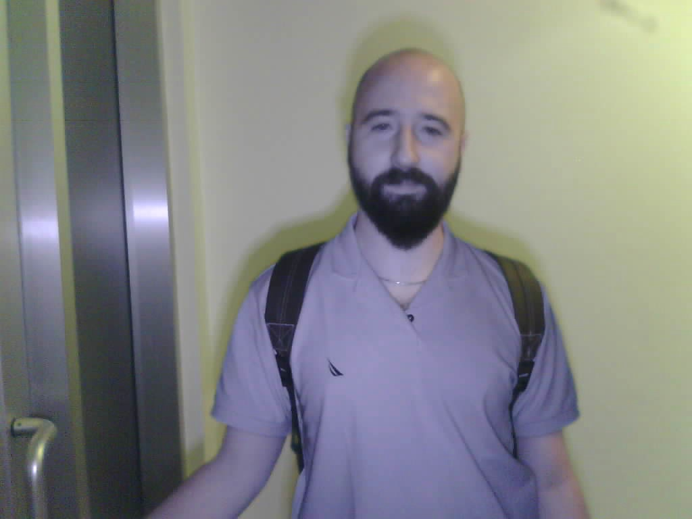

# PDKS-Box_a_Face_Recognition_System
 I have taken the lead in developing an advanced face recognition system aimed at transforming it into a professional-grade product. Throughout this process, I have ensured that every step is executed with precision and under my direct supervision. My roles encompass that of a Product Owner, Computer Vision Engineer, and Python Developer.

In the course of developing the face recognition system, I have been responsible for key strategic initiatives, including the establishment of the IP system, the selection of appropriate models, maintenance strategy, liveness detection method etc.. My meticulous approach to overseeing all facets of the project guarantees comprehensive support for team members, facilitating both technical and managerial guidance.

A distributed system was developed, consisting of stations placed at doors, relays that trigger the doors, and a single host machine. All devices are controlled via the Wi-Fi network of the host machine. For this project, a Raspberry Pi 5 with Debian installed was utilized as the host machine. The stations incorporate components such as the ESP32-S3, RFID card reader, IR LED etc.. The relays and ESP-S were employed for the relay functionality.

This project not only demonstrates my capability to lead a multifaceted team but also underscores my commitment to delivering high-quality solutions in the domain of computer vision. Through effective collaboration and leadership, I strive to elevate the standards of our output, ensuring alignment with industry best practices and user requirements.

The project process is still ongoing...

## Sample Images

 

